# Creating Node-RED Admin Panel using node-red-dashboard


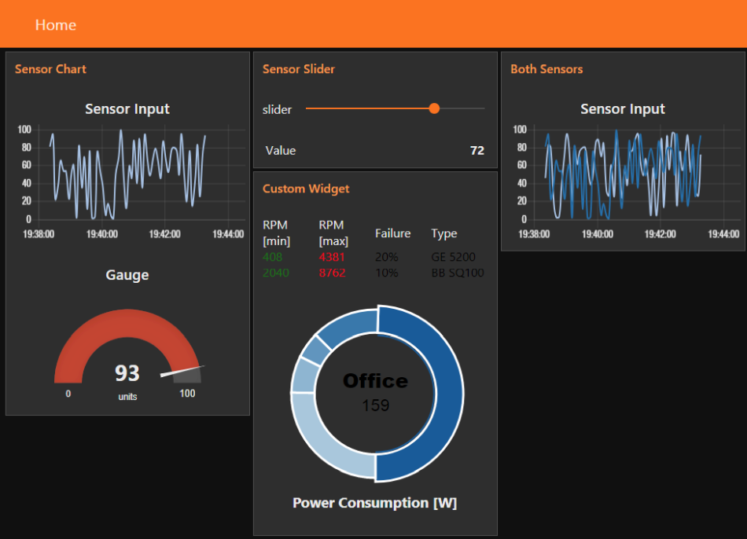

<!-- TOC -->

- [Creating Node-RED Admin Panel using node-red-dashboard](#creating-node-red-admin-panel-using-node-red-dashboard)
  - [Introduction](#introduction)
  - [Adding a Dashboard](#adding-a-dashboard)
  - [Adding another Input](#adding-another-input)
  - [Adding a custom UI Widget](#adding-a-custom-ui-widget)
    - [Using external Libraries](#using-external-libraries)

<!-- /TOC -->

## Introduction

Before we look a how the chart node works, let's configure the inject node to send a timestamp every 5 seconds by setting the payload to timestamp and the repeat field to an interval of 5 seconds.


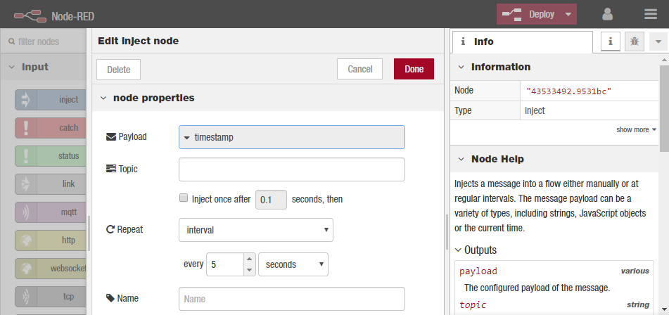


This will act as our repeating trigger. Now we need to set up the function node to generate a random number – we’ll use a simple JS math function to do this:


```js
msg.payload = Math.round(Math.random()*100);
return msg;
```

## Adding a Dashboard

We now have a random number generator to simulate a sensor input - let's install [node-red-dashboard](https://flows.nodered.org/node/node-red-dashboard) to visualize the result. We can install the node by clicking the top-right hamburger menu, choosing __Manage Palette__ and searching for `node-red-dashboard`:


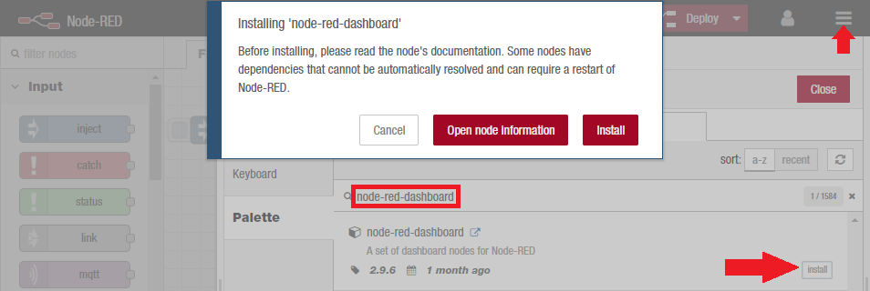


The __chart node__ is now available to be added to our flow:


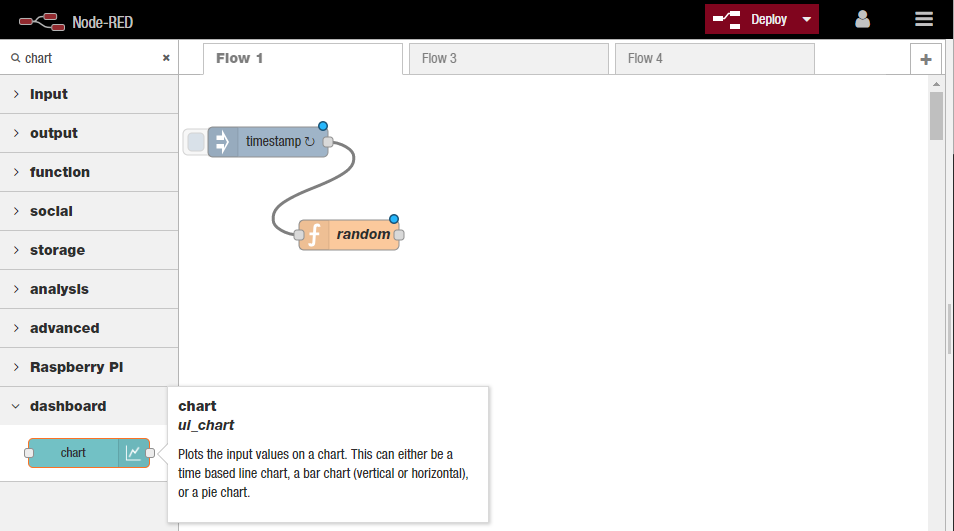


We can [configure](http://www.steves-internet-guide.com/node-red-dashboard/) the chart node:


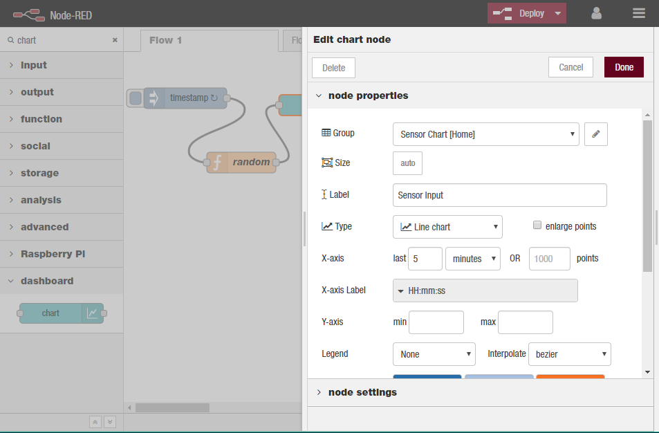


And access it via `http://127.0.0.1:1880/ui/`:


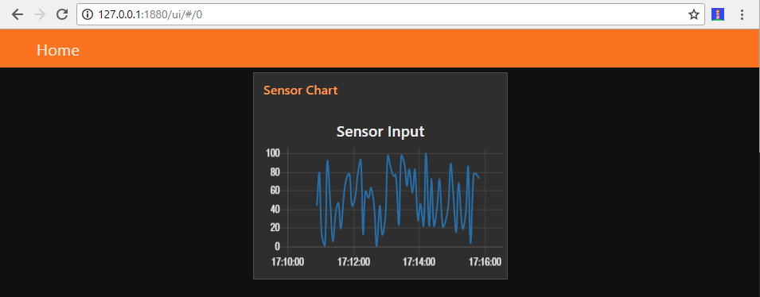


We added the Graph to the Home tab - you can use the [dashboard settings](https://diyprojects.io/node-red-module-dashboard-gui/) to add more tabs or add more Groups to one tab:


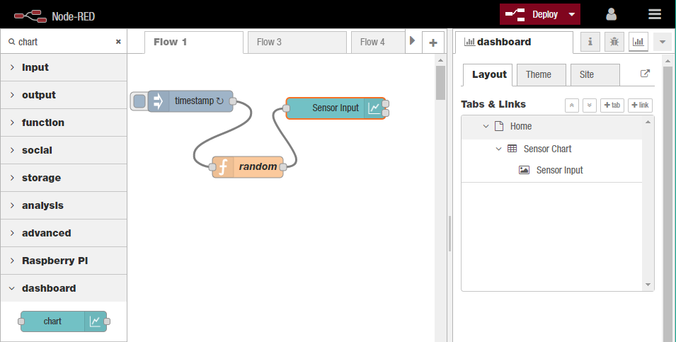


Let’s create a gauge to show the last data value sent. Drag a __gauge node__ from the UI palette and wire it to the Random Number function node. Then double click to open up and let’s configure it:


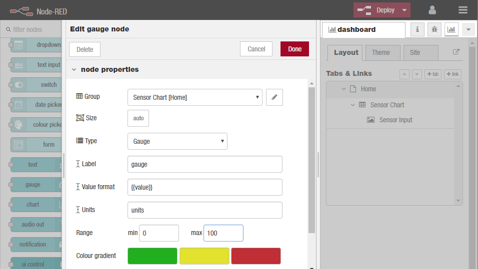


We’ll us the same Tab, home and we’ll also add it to the same group – “Sensor Chart[Home]”. The Min and Max fields allow you to set the min and max values the gauge will shown. Make sure the max is set to 100 which is the most that the random number function node will generate.


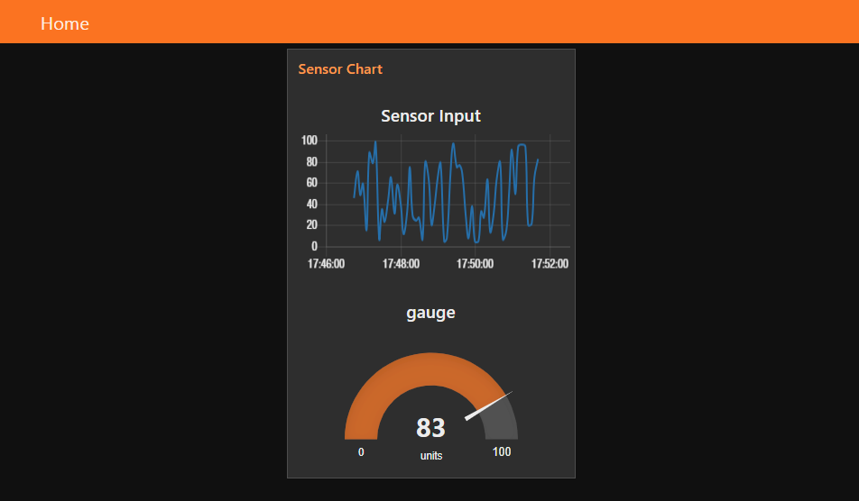


Let’s use a couple of the other UI nodes, a slider node and a text node to show the same data on a slider and as a text string. But this time we want to add them to separate group on the same Home tab:


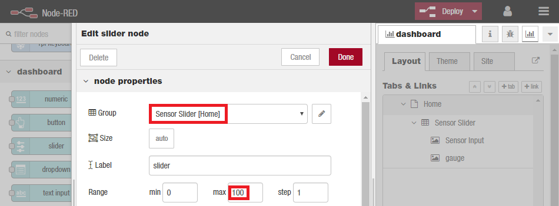


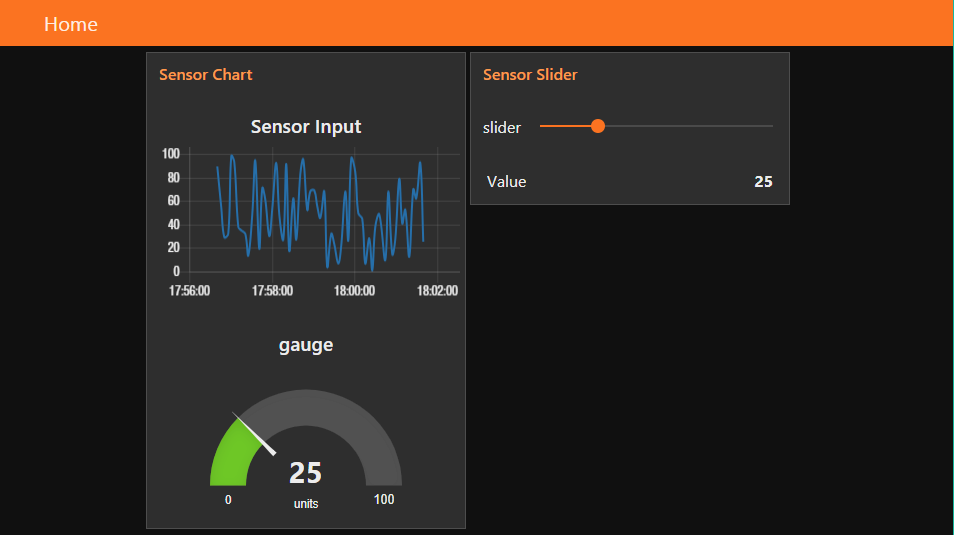


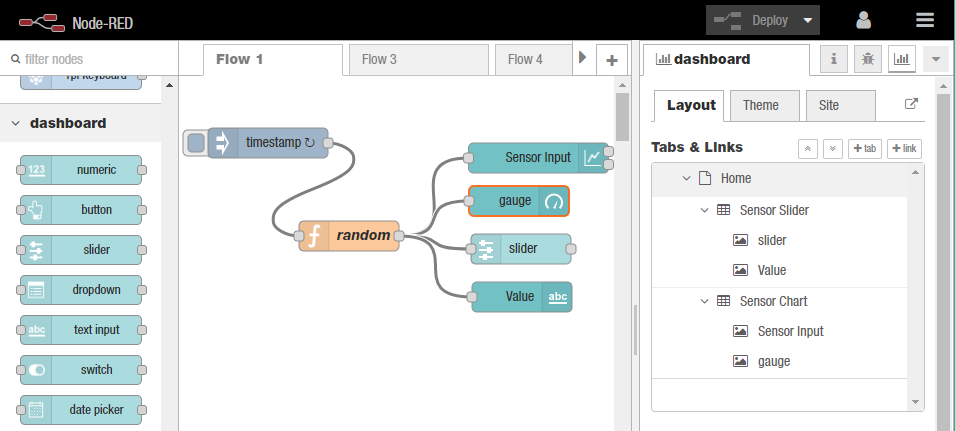


## Adding another Input

To simulate another Sensor Input, we can simply add another random number generator by editing our __function node__ :

```js
var msg = {};
var msg1 = {};

msg.payload = Math.round(Math.random()*100);
msg.topic = 'Line';

msg1.payload = Math.round(Math.random()*100);
msg1.topic = 'Line1';

return [msg, msg1];
```


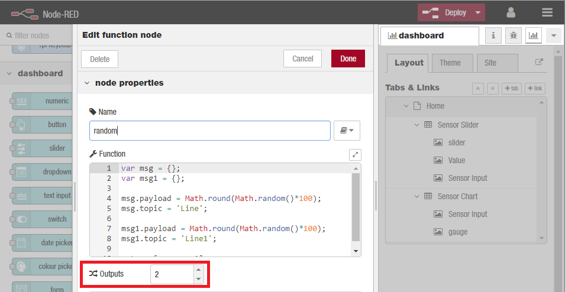


The __function node__ now has 2 outputs - lets connect our __graph and gauge node__ to the first and the __slider and text node__ to the second. And create a second __graph node__ in a new _group_ that is fed both data sources:


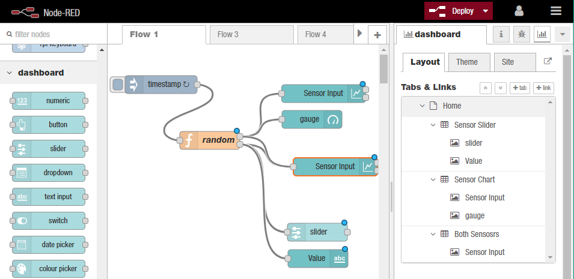


Et voilá!


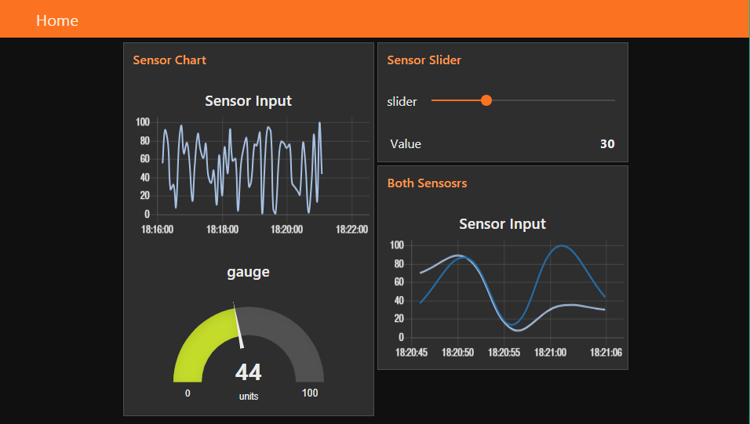


## Adding a custom UI Widget

Let's clone our __function node__, connect the clone to the same timestamp __inject node__ the original is connected to and change the random number generator as follows:


```js
min = Math.round(Math.random()*1000);
max = Math.round((Math.random()*10000)+1000);

msg.payload = {
  factory: {
    machine00: {
      min: min,
      max: max,
      failProb: 20,
      name: "GE 5200"
    },
    machine01: {
      min: min*5,
      max: max*2,
      failProb: 10,
      name: "BB SQ100"
    }
  }
}

return msg;
```

We use the usual Math.random function to generate some fake data. However, instead of just passing this data in as payload, we insert the data into a JSON structure called factory. Factory has two elements -machine00 and machine01 which in turn have four elements min, max, failProb and name.


We now need to create a UI __template node__ and set it up to display on our dashboard. 


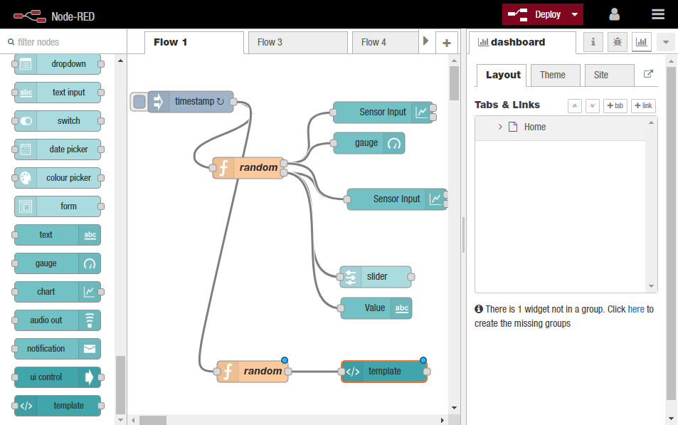


Add the following markup to the __template node__


```html
<div layout="row" layout-align="start center">
  <span flex>RPM Min</span>
  <span flex>RPM Max</span>
  <span flex>Failure</span>
  <span flex>Type</span>
</div>
<div layout="row" layout-align="start center" ng-repeat="machine in msg.payload.factory">
  <span flex style="color: green">{{machine.min}}</span>
  <span flex style="color: red">{{machine.max}}</span>
  <span flex style="color: black">{{machine.failProb}}%</span>
  <span flex style="color: black">{{machine.name}}</span>
</div>
```


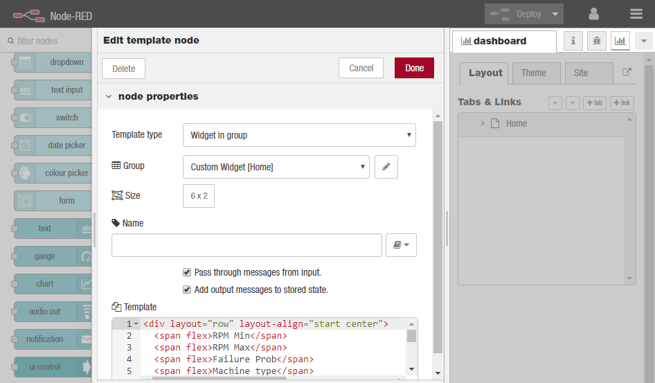


The first \<div\> sets out the labels for the columns defining them using the \<span flex\> tag so they will fit the space nicely. The second \<div\> then uses the ng-repeat command to iterate through the JSON structure in payload and display the data in the columns. Remember, we named each set of data associated with a machine, machine00, machine01 – so we iterate through those.


For each machine element, we use the sub-elements; min, max, failProb and name to fill the data fields. Note how we also use a style directive to set the colour for the text. The result is shown below.


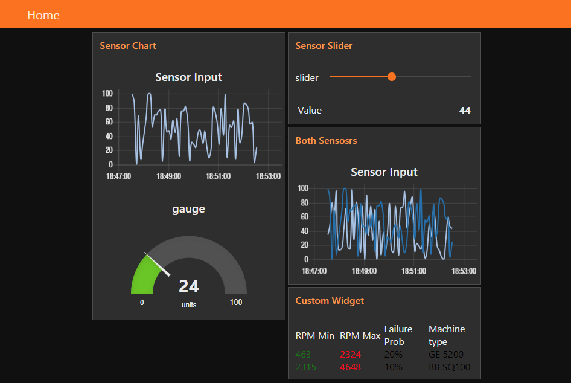


### Using external Libraries

We want to build a custom widget using a 3rd party JavaScript charting library [morris.js](http://morrisjs.github.io/morris.js/). For this example we'll use a __donut chart__ since it's not available in the Node-RED dashboard widget set.


We’ll create a very simple flow for this example consisting of a timer to trigger action every 5 seconds, a __function node__ to generate the fake data and the __template node__ to display the data.


The function node is a simple as possible. It generates a random number and then uses that as a seed to calculate fake values for the different areas that consume power.


```js
seed = Math.round(Math.random() * 1000);

msg.payload = {
  officeW: seed,
  storageW: seed / 4,
  conW: seed / 12,
  parkW:seed / 8,
  serverW: seed / 2
};

return msg;
```


The template node is a little more complex than previous examples because we are pulling in an external charting library (morris.js) and it’s dependencies and we are writing some JavaScript code to use the incoming data (from the function node) to draw the [donut chart](http://morrisjs.github.io/morris.js/donuts.html).


```html
<link rel="stylesheet" href="https://cdnjs.cloudflare.com/ajax/libs/morris.js/0.5.1/morris.css">
 <script src="https://cdnjs.cloudflare.com/ajax/libs/raphael/2.1.0/raphael-min.js"></script>
 <script src="https://ajax.googleapis.com/ajax/libs/jquery/1.9.0/jquery.min.js"></script>
 <script src="https://cdnjs.cloudflare.com/ajax/libs/morris.js/0.5.1/morris.min.js"></script>

<div id="chart-example" style="height: 250px;"></div>

<h3 align="center">Power Consumption [W] </h3>

<script>

(function(scope) {
 var timer = setInterval(function() { //check that the Morris libs are loaded, if not wait
 if (!window.Morris) return;
 clearInterval(timer);
 
 var myData;
 
 var myDonut = Morris.Donut({
 element: 'chart-example',
 data: [
 {label: "Office", value: 1 },
 {label: "Storage", value: 1 },
 {label: "Confernce", value: 1 },
 {label: "Parking", value: 1 },
 {label: "Server", value: 1 }
 ]
 });
 
 scope.$watch('msg', function (msg) { //watch for an incoming NR msg
 if (msg) {
 
 myData = msg;
 myDonut.setData([
 {label: "Office", value: myData.payload.officeW },
 {label: "Storage", value: myData.payload.storageW },
 {label: "Confernce", value: myData.payload.conW },
 {label: "Parking", value: myData.payload.parkW },
 {label: "Server", value: myData.payload.serverW }
 ])
 };
 }); //close out the watch 
 }, 100); // close out the setInterval 
})(scope);


</script>
```

To update the donut chart, we want to look at the incoming Node-RED message, and use its payload to update the donut chart. To do this, we use a watch function to look for changes to the scope variable msg, which contains the incoming Node-RED message.

A good overview is available on the [Angular docs](https://docs.angularjs.org/guide/concepts) page. Briefly, Angular implements a Model-View-Controller (MVC) in which the model (the data) is separate from the view (the DOM). Controllers (code), Expressions and Directives manipulate the data which dynamically updates the view (the Dom) so you see the changes. The model is managed in a structure referred to as the scope.

So coming back to our example, the code at line 37 tells the template node to look at the scope (all our data) and watch for changes to the variable msg. When msg changes, in this case because a new Node-RED message has arrived, the function then executes and simply extracts the new data from the msg.payload and uses it to call the setData() function on the Morris.Donut object (myDonut) which dynamically updates the donut chart.

All of the above is wrapped in a function which passes the scope so that it can be accessed using the watch method.


